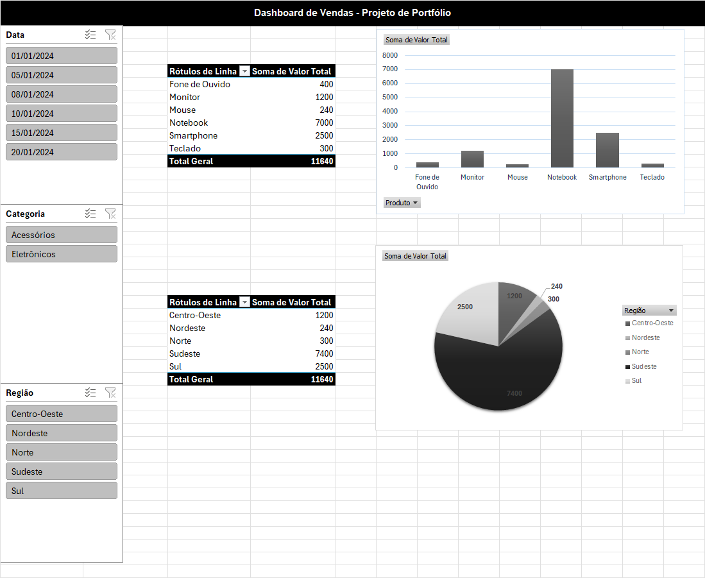

# 📊 Dashboard de Vendas - Excel

Este projeto é uma simulação de um cenário de vendas em uma empresa fictícia. O objetivo é aplicar conceitos de análise de dados e visualização com base em uma planilha Excel, utilizando tabelas dinâmicas, segmentações (slicers) e gráficos interativos.

---

## 🎯 Objetivos do Projeto

- Organizar e limpar dados em formato tabular (.csv)
- Criar visualizações interativas com Tabelas Dinâmicas
- Utilizar segmentações para filtragem dinâmica de dados
- Apresentar insights relevantes para tomada de decisão

---

## 🛠 Ferramentas Utilizadas

- **Microsoft Excel**
- **Tabelas Dinâmicas**
- **Segmentações (Slicers)**
- **Gráficos de Coluna e Pizza**
- Dados fictícios gerados para fins educacionais

---

## 📁 Estrutura

- `dashboard_vendas.xlsx` — planilha com os dados e o dashboard montado
- `dados_vendas.csv` — versão em CSV dos dados
- `README.md` — explicação do projeto

---

## 📈 Principais Insights

- **Produto mais vendido:** Smartphone
- **Categoria com maior receita:** Eletrônicos
- **Região com mais vendas:** Sudeste
- **Mês de maior volume:** Julho (devido à simulação de uma campanha promocional)

---

## 🧩 Funcionalidades do Dashboard

- Gráfico de **Vendas por Produto**
- Gráfico de **Vendas por Região**
- **Segmentações interativas** por:
  - Produto
  - Categoria
  - Região
  - Mês (extraído da Data)

---

## 🚀 Próximos passos

- Reproduzir este dashboard no Google Data Studio ou Power BI
- Criar nova visualização com Python (matplotlib ou seaborn)
- Adicionar análise preditiva futura com Python ou Excel

---

## 📬 Contato

Criado por **Aline Paz**  
🔗 [LinkedIn](https://www.linkedin.com/in/alinedapaz/)  
📧 Email: **aline.santospaz@gmail.com**
