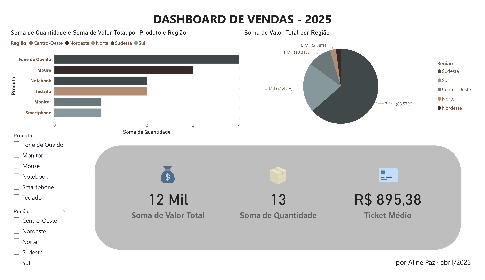
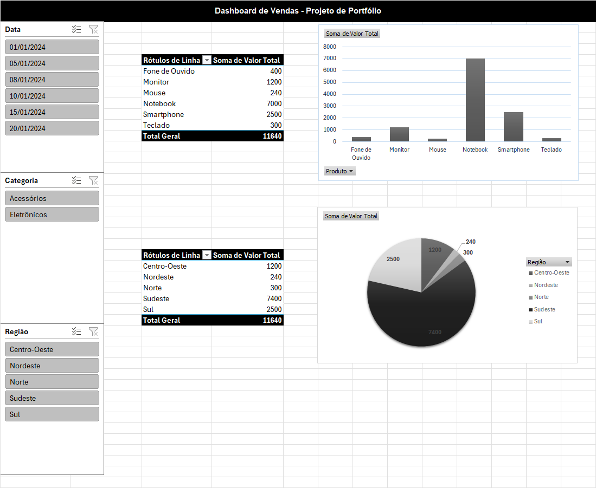

# 📊 Dashboard de Vendas

Este repositório apresenta duas versões do mesmo projeto de análise de vendas: uma desenvolvida no **Excel** e outra no **Power BI**. O objetivo é demonstrar habilidades com visualização de dados, indicadores de desempenho (KPIs) e criação de dashboards interativos e informativos.

---

## 🗂️ Estrutura do Projeto

```
excel/    → Dashboard criado no Excel
powerbi/  → Dashboard criado no Power BI
```

---

## 📈 Funcionalidades dos Dashboards

- KPIs principais: Faturamento, Quantidade Vendida e Ticket Médio  
- Filtros por Região e Produto  
- Gráficos dinâmicos e interativos  
- Layout limpo, moderno e personalizado com cores e ícones

---

## 🧰 Ferramentas Utilizadas

- ✅ Microsoft Excel
- ✅ Power BI Desktop
- 🎨 Design de ícones (Canva/Figma)

---

## 🖼️ Prévia dos Dashboards

### 🟢 Power BI



### 🔵 Excel



---

## 📘 Detalhes da Versão Excel

Este projeto foi criado no Excel com foco na visualização de dados de vendas. Utilizei Tabelas Dinâmicas, Segmentações de Dados e formatações condicionais para destacar os principais indicadores.

### KPIs incluídos:
- **Faturamento Total**
- **Quantidade Vendida**
- **Ticket Médio**

### Gráficos:
- Gráfico de colunas (Faturamento por Região)
- Gráfico de colunas (Faturamento por Produto)

### Recursos adicionais:
- Segmentação de dados para facilitar a análise por região e produto
- Estilo visual padronizado com cores consistentes
- Disposição dos elementos priorizando clareza e foco nos KPIs

📎 Arquivo: `excel/dashboard-vendas.xlsx`  
🖼️ Imagem: `excel/imagem-dashboard-excel.png`

---

## 👩‍💻 Sobre a Autora

Desenvolvido por **[Aline Paz](https://github.com/alinepax)**  
📧 Email: aline.santospaz@gmail.com

🎯 Este projeto faz parte do meu portfólio como profissional em transição para a área de Dados e Tecnologia.

---

⭐ Se você gostou, deixe uma estrela no repositório!
